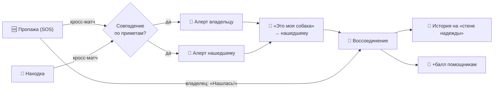

# 🐾 Лапка помощи

> Городское сообщество собачников Москвы для оперативного поиска потерявшихся собак.
> **Каждый хвост на учёт.**

«Лапка помощи» объединяет владельцев собак в единую городскую стаю взаимопомощи:
SOS-оповещение соседей, умный кросс-матчинг «пропажа ↔ находка», карта поиска,
районное комьюнити, цифровой паспорт питомца с QR, дневник здоровья, магазин
адресников. Маскот — корги Шуня — живёт во всех ключевых сценариях, в том числе
как анимированный помощник в углу.

---

## ✨ Возможности платформы

**Поиск и воссоединение**
- **SOS-объявление** о пропаже за минуту: радиус, награда, фото, район, рассылка соседям и в Telegram. Можно **без аккаунта** — быстрая заявка (кличка/район/фото).
- **Находки**: «нашли собаку — ищем хозяев», полный жизненный цикл (open → reunited).
- **Умный кросс-матчинг** пропажа↔находка (район, порода, окрас, размер, время, perceptual-hash фото) — показывается на детальных страницах и проактивно шлёт алерты **обеим сторонам**.
- **«Это моя собака»** — прямой канал владелец→нашедший, даже когда у находки нет публичных контактов.
- **Наблюдения** на карте (Leaflet), след перемещений, кредит «кто помог».
- **Воссоединение**: владелец отмечает «Нашлась!», помощникам — +балл (атомарно, разово), владельцу — нудж рассказать историю на «стену надежды».

**Распространение (4 канала)**
- **OG-карточки** (динамический satori-рендер) для шаринга `/lost/[id]` и `/found/[id]` в соцсетях.
- **Telegram-бродкаст** районного канала (пропажи и находки).
- **SEO**: активные пропажи/находки и паспорта — в `sitemap.xml` (органический поиск Google).
- **RSS** активных пропаж (`/feed/lost/rss`) и открытых находок (`/feed/found/rss`) — для агрегаторов и приютов.

**Печать**
- **Плакат пропажи** `/poster/[id]` и **плакат находки** `/found/[id]/poster` (A4, QR, print-CSS).
- **Листовка района** `/poster/district/[district]` — все пропажи района на одном листе.

**Кабинет и забота**
- Питомцы: мастер из 6 шагов, публичный QR-паспорт `/p/[id]`, **редактирование**, фотогалерея.
- **Дневник здоровья** с напоминаниями + экспорт в **календарь (.ics)**.
- Редактирование своих объявлений (пропажа/находка), чек-лист поиска, буст.
- **Экспорт персональных данных** (152-ФЗ) и удаление аккаунта.

**Сообщество и витрина**
- Районная лента (посты/лайки/комментарии), рейтинг волонтёров, истории спасения.
- Живой дашборд **«Пульс спасения»** `/pulse` (метрики, доля найденных, топ-районы).
- **Хаб района** `/district/[id]` — розыски, находки и истории возвращения одного района Москвы в одном месте (SEO-посадочная под локальный поиск).
- Магазин адресников (каталог, варианты с надбавками, корзина в cookie, заказ + страница подтверждения `/shop/order/[id]`), пристройство, B2B-партнёры, подписка «Лапка+».

---

## 🧰 Технологический стек

| Слой | Технология | Зачем |
|------|------------|-------|
| Фреймворк | **Next.js 15 (App Router) + TypeScript** | SSR, файловый роутинг, Server Components, route-handlers |
| База данных | **PostgreSQL + Prisma** (docker-compose, порт 5433) | пользователи, питомцы, объявления, посты, заказы, уведомления |
| Авторизация | **Сессии на cookie + scrypt** (`src/lib/auth.ts`) | без внешних зависимостей |
| Стили | **Tailwind CSS v4** (`@theme`-токены, WCAG-AA) | дизайн-система |
| Анимации | **Framer Motion** + CSS | живой маскот, появления секций |
| Карта | **Leaflet + OpenStreetMap** (`src/components/map`) | карта поиска без API-ключа |
| Уведомления | **web-push** · **nodemailer** · Telegram | мультиканальная доставка (best-effort) |
| Кэш/лимиты | **ioredis** | rate-limit и кэш (`src/lib/ratelimit.ts`) |
| Иконки / QR | **lucide-react** · **qrcode.react** | UI и QR-паспорта/плакаты |
| OG-картинки | **next/og (satori)** | динамические карточки шаринга |
| Тесты | **Vitest** + E2E-харнесс `tools/verify-all.mjs` | юниты + 33 живых сюиты |

> Пины (Node 20.8.1): Next **15.5.19**, React **19.2**, Prisma **5.22**, Vitest **2.1.9**.

---

## 🔁 Петля воссоединения



---

## 🌐 Ключевые маршруты и API

| Группа | Маршруты |
|--------|----------|
| Пропажи | `POST /api/sos` · `PATCH/PUT /api/reports/[id]` · `/lost/[id]` · `/lost/[id]/edit` · `/poster/[id]` |
| Находки | `POST /api/found` · `PATCH/PUT /api/found/[id]` · `POST /api/found/[id]/claim` · `/found` · `/found?district=…` · `/found/[id]` · `/found/[id]/poster` · `/found/[id]/edit` |
| Матчинг | `src/lib/match.ts` (район+приметы+время+photo-hash) |
| Наблюдения | `POST /api/sightings` · карта `/map` |
| Питомцы/здоровье | `/api/pets*` · `/api/health*` · `GET /api/pets/[id]/health/calendar` (.ics) |
| Уведомления | `/api/notifications*` · `/api/push/(un)subscribe` |
| Распространение | `/feed/lost/rss` · `/feed/found/rss` · `/lost|found/[id]/opengraph-image` · `sitemap.xml` |
| Печать | `/poster/[id]` · `/found/[id]/poster` · `/poster/district/[district]` |
| Аккаунт | `GET /api/account/export` · `POST /api/account/delete` |
| Магазин | `/shop` · `/shop/product/[slug]` · `/shop/cart` · `POST /api/shop/cart` · `POST /api/shop/checkout` · `/shop/order/[id]` (подтверждение) |
| Дашборд | `/pulse` · `/district/[id]` (хаб района) |

---

## 🚀 Запуск

```bash
docker compose up -d        # PostgreSQL (порт 5433)
cp .env.example .env        # DATABASE_URL уже настроен
npm install
npm run db:migrate          # применить миграции
npm run db:seed             # демо-данные
npm run dev                 # http://localhost:3000 (или ближайший свободный порт)
```

Прочее: `npm run build` · `npm run lint` · `npm test` · `npm run db:studio`.
Демо-вход: телефон `+79991234567` / email `anya@example.ru`, пароль `demo1234`.
Устанавливается как **PWA** на домашний экран iOS/Android.

---

## 🧪 Тесты

- **Юниты** — `npm test` (Vitest): матчинг, профанити-фильтр, склонения, чек-лист, pulse и др.
- **E2E-сюиты** — `node tools/verify-all.mjs` (нужен поднятый dev-сервер + БД): **33 сюиты**
  одной командой, реальные транзакции против `:3002` с проверкой БД и самоочисткой (шаг 0
  сметает сирот прерванных прогонов). Помимо полного прогона интерактивных флоу (`e2e-flows`) —
  кросс-матчинг, пульс, OG, экспорт, фильтры (лента и находки по району), календарь, плакаты,
  sitemap, RSS, жизненный цикл, редактирование, soft-404, матч-алерты, идемпотентность кредита,
  «это моя собака», листовка и **хаб района**, **подтверждение заказа** и ценообразование
  вариантов, **валидация загрузки фото** (DB-блоат/DoS), **авторизация мутирующих роутов**
  (IDOR/эскалация прав), **гостевой SOS** и приватность селектора питомцев. Упавший сьют
  ретраится после ожидания готовности сервера — без ложных «красных» от транзиентных блипов.

---

## 🗂️ Структура

```
docker-compose.yml         # PostgreSQL
prisma/                    # schema.prisma, миграции, seed.mjs
tools/                     # verify-*.mjs (E2E-харнесс), audit/seed-утилиты, cut_poses.py
src/
├── app/                   # маршруты (App Router)
│   ├── api/               # 40+ route-handlers (sos, found, reports, health, account, …)
│   ├── lost|found|poster|pulse|feed|map|community|shop|profile|p/[id] · sitemap.ts · not-found.tsx
├── components/            # ui/ brand/ layout/ landing/ feed/ found/ map/ poster/ pets/ reunion/ …
└── lib/                   # db, auth, match, notify, push, email, telegram, ratelimit,
                           # profanity, districts, pulse, format, storage, petForm, …
```

---

## 🗺️ Дорожная карта

- [x] **Фундамент** — каркас, дизайн-система (WCAG-AA), лендинг, навигация, PWA.
- [x] **Аккаунты** — регистрация/вход (телефон/email), сессии, подтверждение/сброс.
- [x] **Питомцы** — мастер, QR-паспорт, редактирование, фотогалерея, дневник здоровья.
- [x] **Поиск** — SOS, карта (Leaflet), наблюдения, кросс-матчинг, плакаты, листовка района.
- [x] **Воссоединение** — жизненный цикл, «Это моя собака», нудж истории, стена надежды.
- [x] **Распространение** — OG, Telegram-канал (пропажи + находки), sitemap (SEO), RSS (пропажи + находки).
- [x] **Комьюнити/витрина** — лента, волонтёры, «Пульс», магазин, пристройство, партнёры, Лапка+.
- [x] **Качество** — 33 E2E-сюиты (самоочистка + health-retry), регулярные ревью-проходы, a11y-аудит, фикс soft-404, гарды загрузки фото и авторизации.
- [ ] **Подписка на район** — `DistrictSubscription` (мульти-район, алерты «пропажа + находка» по выбранным районам). Требует миграции Prisma (`db push` + `generate`) и рестарта dev-сервера: на Windows `prisma generate` блокируется живым сервером (EPERM на `query_engine`), поэтому делать в supervised-сессии, не в автолупе.
- [ ] **Прод** — деплой на КТС, VAPID-ключи для реального web-push, QA на живых устройствах.
- [ ] **Нативное приложение** — Expo/React Native.

---

## ⚠️ Заметки

- **Уведомления — рабочие, мультиканальные**: `notifyUser` всегда пишет in-app (страница
  `/notifications`) и best-effort доставляет в **web-push / e-mail / Telegram** (`src/lib/notify.ts`).
  Реальная push/email-доставка включается при настроенных VAPID/SMTP/бот-ключах; без них —
  только in-app (и no-op остальные каналы).
- **Платежи — демо**: буст и «Лапка+» логируют `Purchase`, заказ создаёт `Order` — без реального шлюза.
- **Карта** — Leaflet + OpenStreetMap, без API-ключа.
- **БД** — PostgreSQL (docker-compose). Массивы (приметы/маршруты/характер) — JSON-строками.
  При расхождении миграций после `git pull`: `npx prisma migrate reset` (или `docker compose down -v`).
- **Маскот в углу** — анимирован на реальном арте (прозрачный фон вырезан `tools/cut_poses.py`):
  дышит, покачивается, тянется к курсору, машет при наведении.
